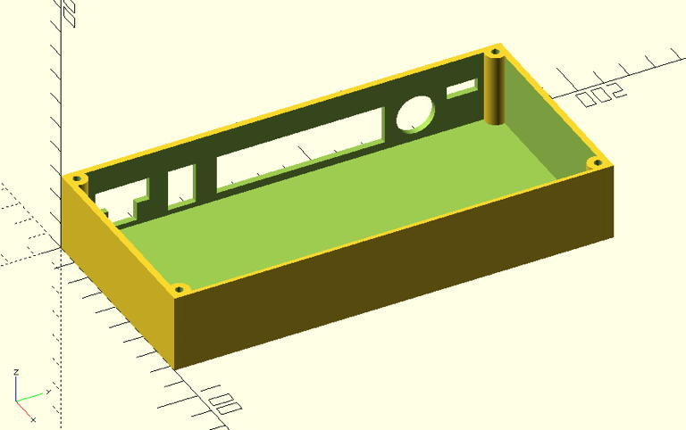
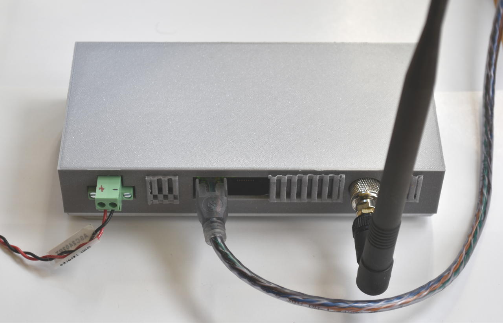
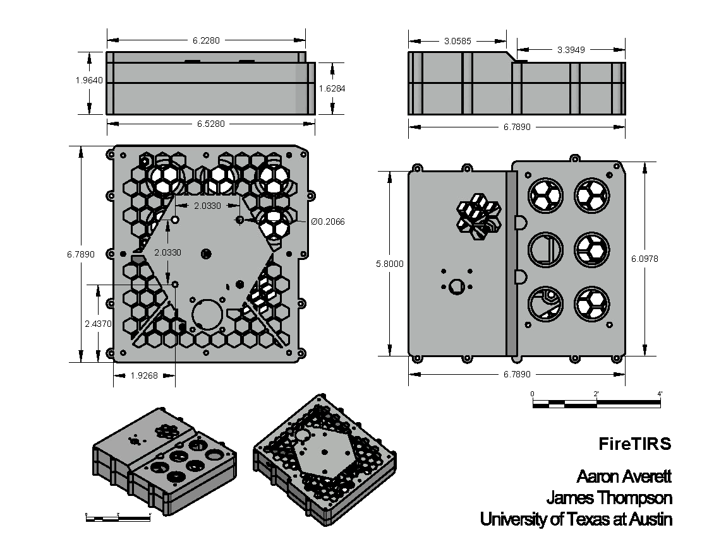

## FireTIRS Enclosures
This directory contains the design files for various enclosures used in the FireTIRS project.

### Zumlink Z9 T2 Enclosure
A simple 3D printed Freewave Zumlink Z9 T2 base station enclosure.  Designed using OpenSCAD and includes the generated STL.

### FireTIRS UAV Enclosure
A 3D printable enclosure.  Designed using AutoCAD and includes the generated STLs.

