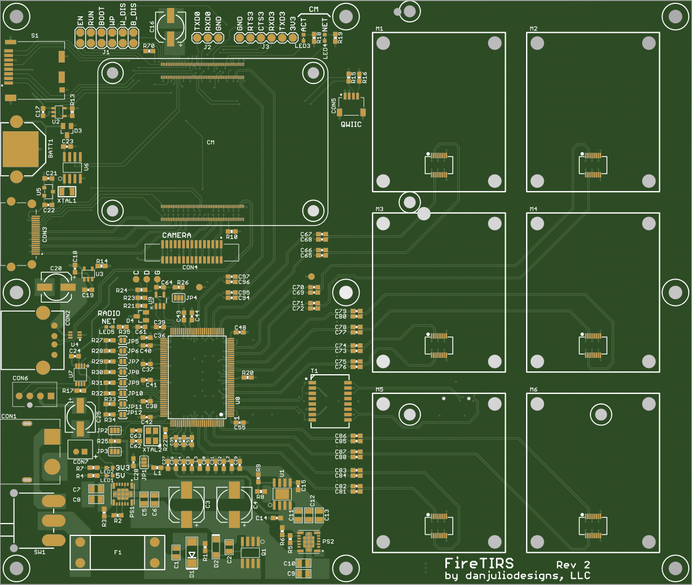
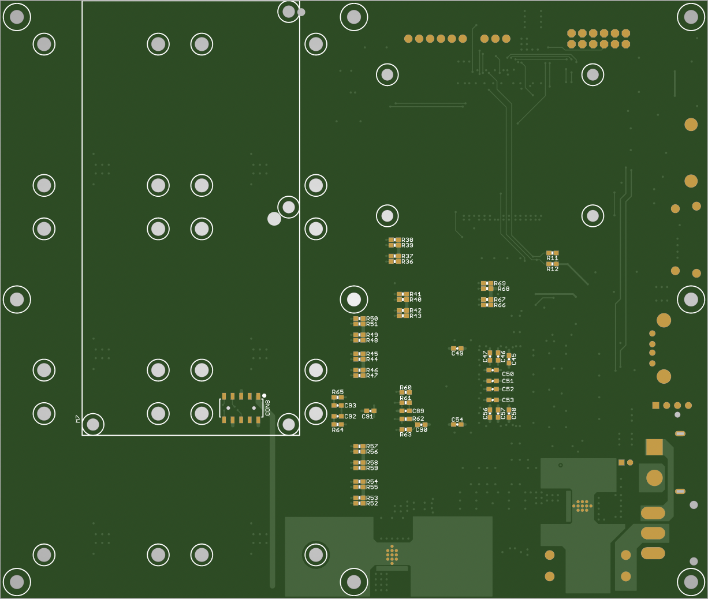
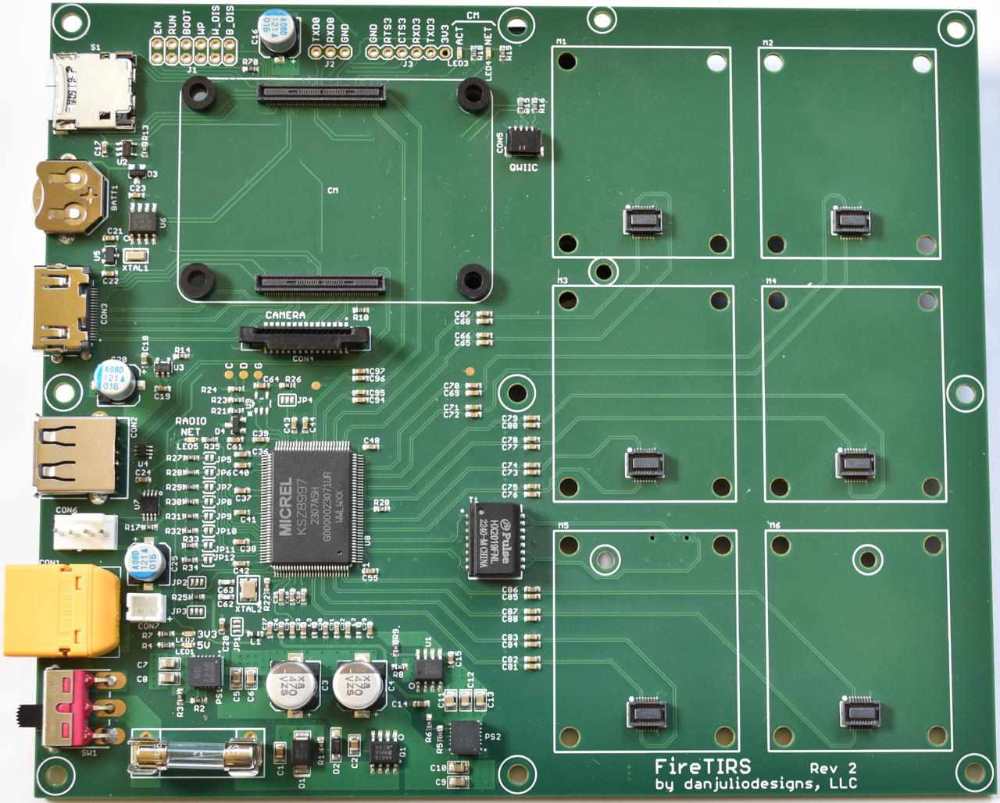
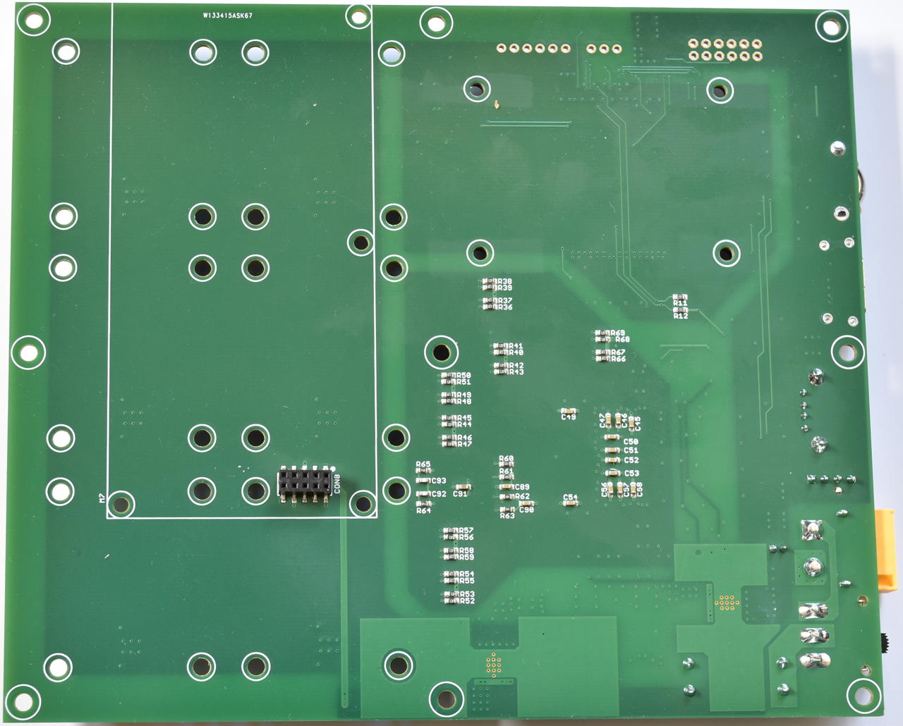

## FireTIRS PCB Assembly
This directory contains the design files and documentation necessary to build the FireTIRS PCB Assembly.

* ```design``` : Contains the Eagle version 7.7 CAD source design files (schematic and layout).
* ```documentation``` : Contains supporting documentation files including Bill-of-Material (BOM), component load list, component centroid file, stack-up information and PDF versions of the schematic and layout.
* ```gerbers``` : Contain the PCB gerber files.
* ```stencils``` : Contain the stencil gerber files.

### Printed Circuit Board

* Layer Count: 4
* Material: FR4
* Dimensions: 6.5" x 5.5" (165.1mm x  139.7mm)
* Thickness: 0.062" (1.6mm) thickness





#### Gerber files

| File Suffix | Description |
| --- | --- |
| GBL | Bottom Copper (Layer 4) |
| GBO | Bottom Silkscreen |
| GBS | Bottom Soldermask |
| GL2 | Inner Layer 2 Copper |
| GL3 | Inner Layer 3 Copper |
| GML | Mill layer (dimensional) |
| GTL | Top Copper (Layer 1) |
| GTS | Top Soldermask |
| GTO | Top Silkscreen |
| TXT | Drill file |

### Assembly
The PCB Assembly has surface-mount parts on top and bottom and through-hole parts on top.


(note: Raspberry Pi 4 Compute Module spacers shown are not part of the assembly at this stage)



#### Stencil files
 
| File Suffix | Description |
| --- | --- |
| GBP | Bottom Paste |
| GTP | Top Paste |
