## FireTIRS Hardware

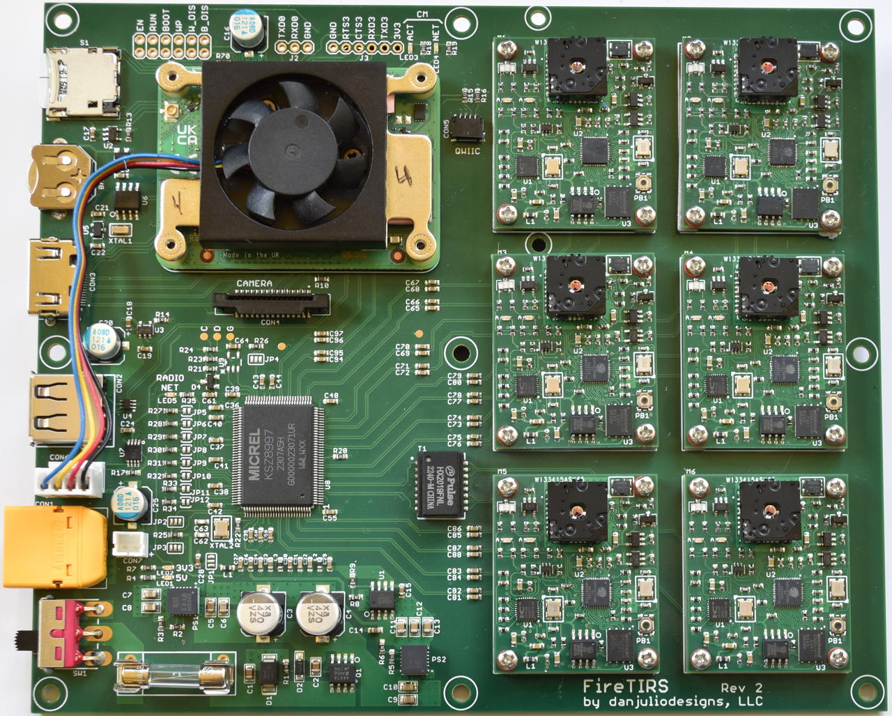

### Block Diagram
FireTIRS is designed to be a mobile sensing platform.  It contains a Raspberry Pi 4 Compute Module (CM) running Linux, six Flir Lepton 3.5-based thermal imaging modules, a full set of peripheral interfaces including an IP-based long-distance digital radio, and is powered via a wide-range DC input.  On-board communication between the Compute Module, digital radio and thermal imaging modules is provided by a 100 Mbps ethernet switch.

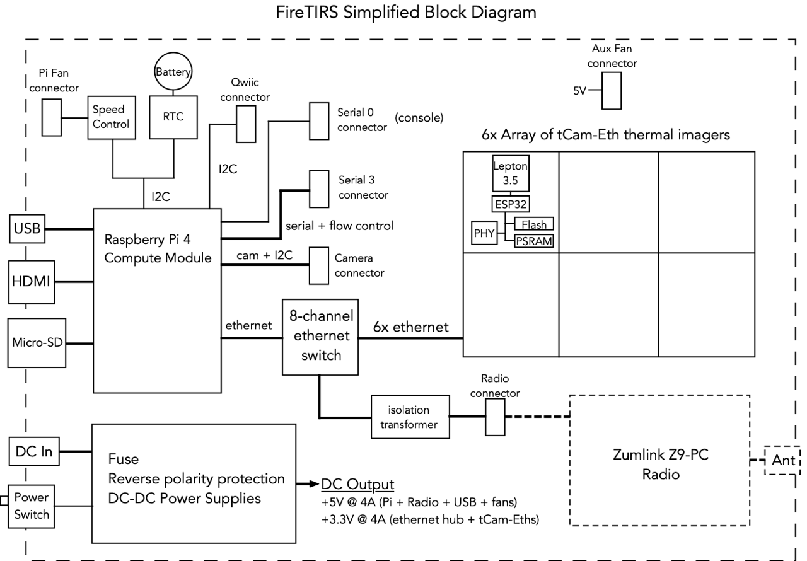

The full schematic and design are in the ```pcb_assembly``` directory here.

#### tCam-Eth thermal imaging module
The tCam-Eth thermal imaging camera module is documented at [https://github.com/danjulio/tCam/tree/main/tCam-Eth](https://github.com/danjulio/tCam/tree/main/tCam-Eth).

#### Future extensibility
The tCam-Eth modules may be replaced by another module that utilizes ethernet communications and can be powered from a 3.3V power rail.

### Dimensions

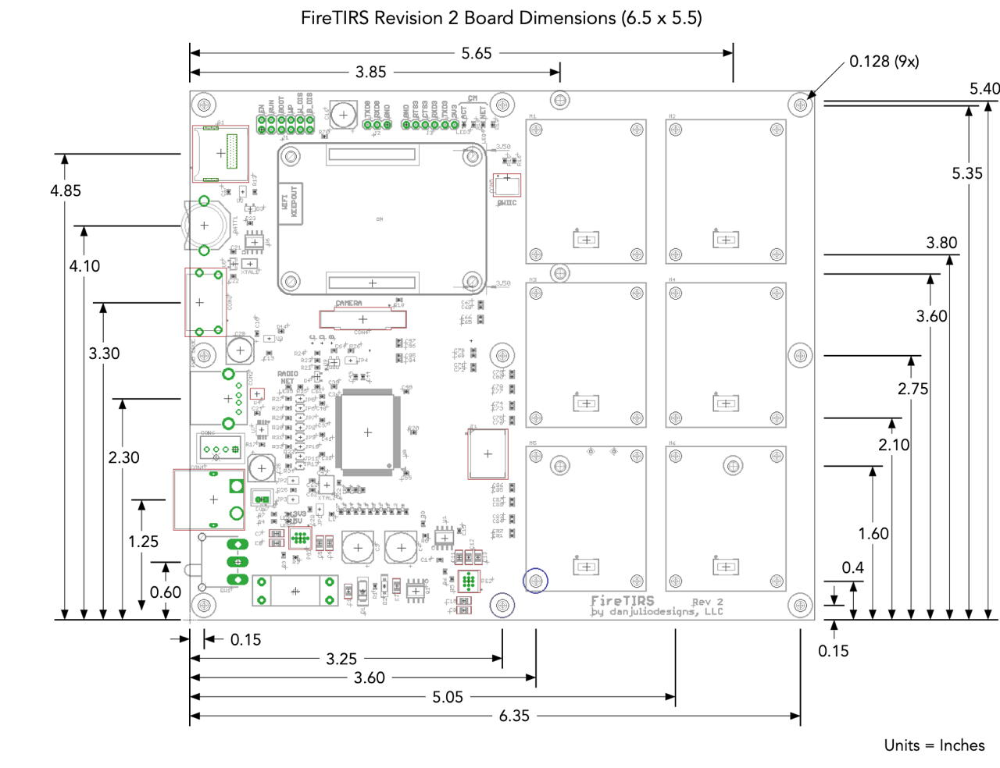

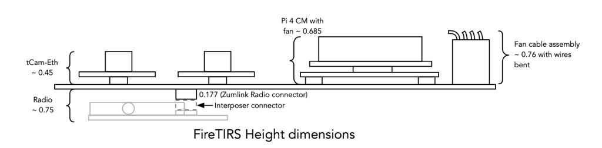

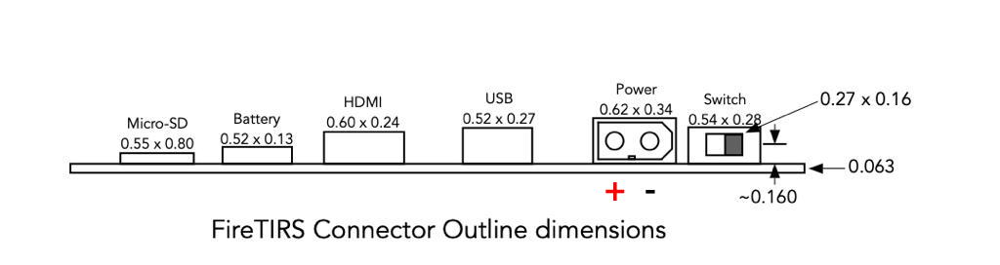

### Power Subsystem

#### DC Input
FireTIRS is designed to be powered from a 12-24VDC power source via a traditionally polarized XT60 male connector. Typically the power source should be capable of providing at least 25 watts of power although theoretically FireTIRS could require up to 42 watts.

FireTIRS provides reverse polarity protection.  Absolute maximum input voltage is 27 volts.  Minimum input voltage is about 7 volts.  

#### Power Consumption
Typical power consumption for a system with an idle Compute Module is about 6 watts.  Running compute-intensive code on the CM and/or heavy communications with the radio will increase power consumption appreciably.

#### 5V Internal Bus
The 5V internal bus is supplied by a built-in DC-DC converter and supplies power to the following subsystems.  It is theoretically capable of supplying up to 4 amps but should be run at 2A maximum.

* Raspberry Pi 4 Compute Module : typ 400 - 1400 mA
* Raspberry Pi 4 Speed controlled fan : typ 150 mA
* Auxiliary fan : typ 150 mA
* External Radio Module : typ 220-800 mA
* USB Port : max 1A (current limited)
* HDMI : typ 50 mA, max 500 mA (current limited)


#### 3.3V Internal Buses
FireTIRS has two internal 3.3V busses.

##### Sensor 3.3V Bus
The primary 3.3V bus is supplied by a built-in DC-DC converter and supplies power to the following subsystems.  It is theoretically capable of supplying up to 4 amps but should be run at 2A maximum.

* tCam-Eth modules : typ 150 mA, max 450 mA during Lepton FFC
* Ethernet hub : max 900 mA

##### Compute Module 3.3V Bus
The Raspberry Pi 4 Compute Module provides a utility 3.3V bus used for the following subsystems.

* Micro-SD Card
* Real Time Clock IC
* Qwiic connector (external I2C peripherals)
* CM Fan controller IC
* Power for Serial 3 connector
* CM Status LEDs
* I2C Bus pull-ups

### Micro-SD Card
FireTIRS is designed to work with Raspberry Pi 4 Compute Modules without internal eMMC mass storage memory.  It uses the Micro-SD card for bootable mass storage.

The Raspberry Pi 4 Compute module part number CM4108000 has 8 GB RAM, Wireless capability and no eMMC.

### Interfaces

#### Camera
The CM CAM0 CSI signals and ID I2C signals are connected to the Camera connector and support any Raspberry Pi compatible camera module using a 15 pin 1mm pitch flex cable.

#### HDMI
The HDMI port is connected to CM HDMI0 and may be used to connect an external monitor for lab bench configuration.

#### USB
The Type A USB port is connected to the CM USB 2.0 interface and may be used to connect external HID devices such as a mouse and keyboard for lab bench configuration or an external USB memory for additional mass storage.

### I2C interfaces

#### ID I2C
The ID\_SC and ID\_SD I2C pins (normally used for Raspberry Pi Hat ID) are connected to the camera connector and used to initialize it.

#### Internal I2C
The CM internal I2C bus is used to communicate with the EMC2301 fan controller and PCF85063AT Real-time-clock ICs.

#### Qwiic connector I2C
The I2C bus that may be enabled on GPIO2 and GPIO3 (traditional Raspberry Pi user I2C bus) is connected to a Sparkfun Qwiic style connector (aka Adafruit Stemma QT).  This may be used to extend the capabilities of FireTIRS by the addition of one or more sensor modules made by a variety of manufacturers.

FireTIRS includes 4.7 k-ohm pull-up resistors on this I2C bus.  Many modules come with built-in 10 k-ohm pull-ups.  Be sure to calculate the effective pull-up values when adding external devices and make sure it is within legal values.  Often the pull-up resistors in the add-on module may be disabled by removing a jumper.

### Serial Interfaces

#### Serial 0
The traditional Raspberry Pi Serial port available on GPIO14 and GPIO15 is brought out to the Serial 0 header.  This is typically used for a 3.3V logic-level serial console.  There is no flow control.

#### Serial 3
The CM Serial port 3 (Alt4 functionality of GPIO4-7) is brought out to the Serial 3 header.  This may be used to connect to an external serial device using 3.3V logic-levels.  It includes RTS and CTS flow-control and [limited] 3.3V power if necessary.

### Compute Module control header
The following CM control signals are brought out to the CM header.  They may be grounded using a jumper to the pin vertically above them.

| Signal | Description |
| --- | --- |
| EN | Global Enable - Pulling this pin low puts the CM in the lowest possible power-down state.  After a software shutdown, EN needs to be pulled low for > 1 mSec to restart the power system on the CM. |
| RUN | This pin when high signals that the CM has started. Driving this pin low resets the module. This should be done with caution; if files on a filesystem are open they will not be closed. |
| BOOT | During boot if this pin is low, booting from eMMC will be stopped and booting will be transferred to rpi boot which is via USB. |
| WP | Pulling this pin low will prevent changing the contents of the CM on-board EEPROM. |
| W_DIS | Pulling this pin low will disable the Wifi interface. |
| B_DIS | Pulling this pin low will disable the Bluetooth interface. |

### Ethernet switch controller configuration
The KS8997 8-port 10/100 Mbps ethernet switch chip is configured for default operation.  This should be sufficient for most applications.  However two mechanisms for reconfiguring it are exposed on FireTIRS.

Please see the KS8997 Datasheet (M9999-022807-1.31) for more information.

#### Jumper configuration
Jumpers are designed to be closed by using a solder blob across two terminals.

| Jumper | Description |
| --- | --- |
| JP2 | MODESEL[0] - LED Mode, default pulled to ground for LED Mode 0. Only affects operation of LED3, the Radio link activity indicator. |
| JP3 | MODESEL[1] - LED Mode, default pulled to ground for LED Mode 0. Only affects operation of LED3, the Radio link activity indicator. |
| JP4 | EN1P - Enable 802.1p for all ports, default pulled to ground to disable 802.1p. |
| JP5 | Programs back-off aggressiveness for half-duplex mode.  Default floating for more aggressive back-off. |
| JP6 | Programs retries for frames that encounter collisions. |
| JP7 | Programs flow control.  Default floating for flow-control enabled. |
| JP8 | Programs broadcast storm protection.  Default floating for unlimited broadcast frames. |
| JP9 | Reserved - leave floating. |
| JP10 | Programs address aging.  Default floating to enable 5 minute aging. |
| JP11 | Programs frame length enforcement.  Default floating to set max length of 1536 bytes. |
| JP12 | Programs half-duplex back pressure.  Default floating to enable half-duplex back pressure. |

Note JP2, JP3 and JP4 are 3-way jumpers with a default connection to ground via a PCB trace.  This trace must be cut before a solder jumper is made between the center and other terminals.  Please refer to the FireTIRS PCB Layout and schematic for more detail.

#### External EEPROM configuration
An optional (unpopulated) I2C EEPROM such as the Microchip AT24C01C-STUM-T or AT24C01D-STUM-T may be used to configure the KS8997.  It may be programmed in-situ using TP1-TP3 or externally before being soldered to FireTIRS in location U9.  Please see the KS8997 specification for the EEPROM contents.  The programming procedure is beyond the scope of this document.

### System Assembly Notes

#### Auxiliary Fan
FireTIRS provides 5V on CON7 (JST B2B-PH-K-S) for an external DC fan.  The connector is not current limited but fans up to 500 mA should work without issues.

#### Compute Module Fan modifications
FireTIRS supports a 5V Raspberry Pi Compute Module fan assembly with tachometer and PWM speed control signals such as the CM4-FAN-3007-5V available from Waveshare and others.  The fan assembly must be slightly modified so that the wires exit the opposite side before connecting on FireTIRS.

First note the order of wires in the connector.  Then remove the wire connectors for the connector shroud using a small flat-head screwdriver to press down on the wire connector barb while pulling gently on the wire.

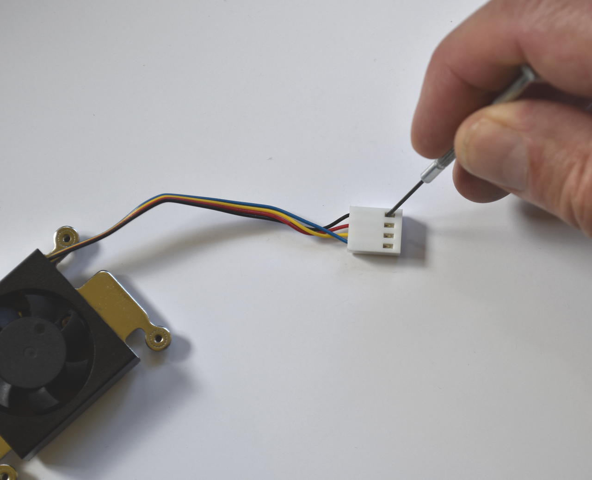

Each wire should come free as shown below.  Be careful not to damage the wire connector.

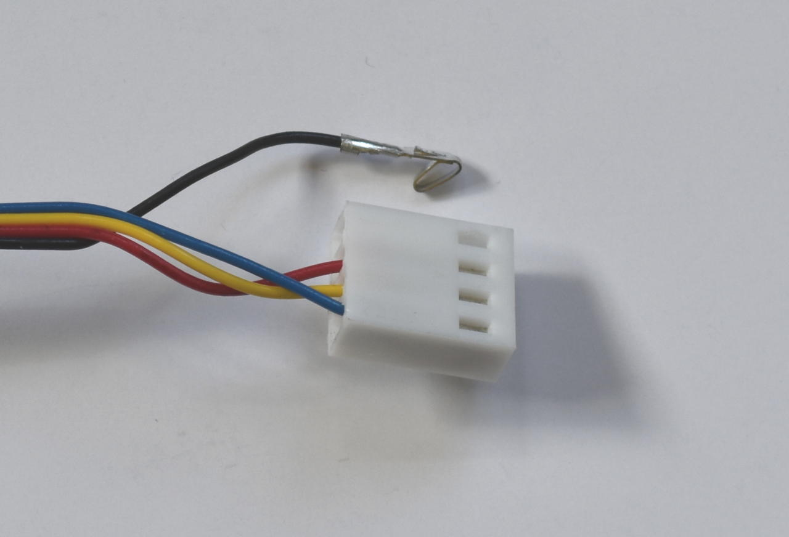

Then carefully unscrew the fan motor assembly from the fan enclosure by removing the 3 screws with locations shown below (one is covered by a fan blade).

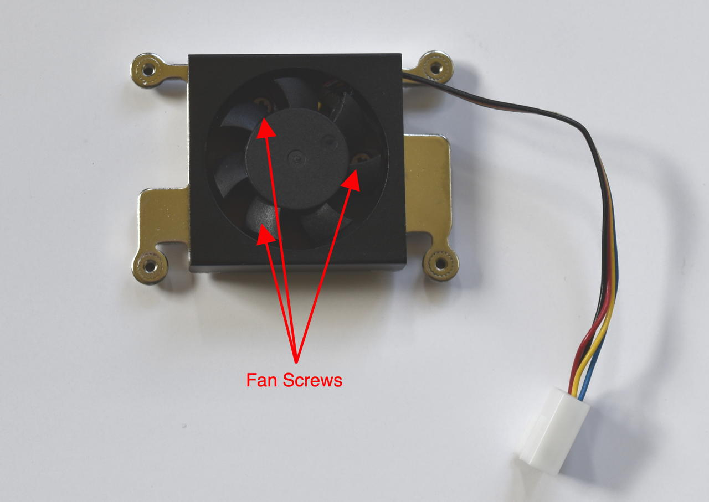

Pull the fan from the enclosure and then carefully thread the wires through the enclosure grill, removing them from the enclosure entirely.  It is easiest to thread two at a time by folding two back along the wire harness.

Then rethread the wires through the opposition side and screw the fan motor back into the enclosure (it will align with the 3 holes although it has been rotated).

Re-insert the wires into the connector shroud with the wire connector barb facing the side of the connector originally used to release it.  Be sure to match the original order!

The complete assembly, mounted on the Compute Module is shown below.

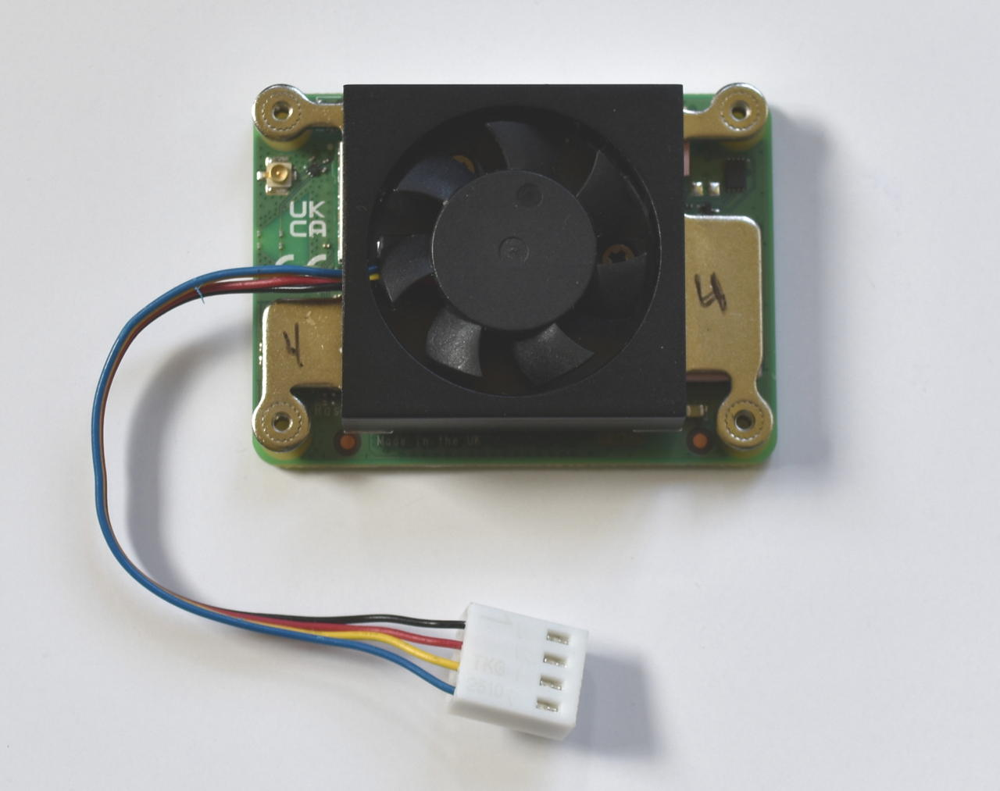

#### Compute Module mounting
The fan assembly comes with two different heights of spacer that fit between the CM and the FireTIRS board.  Use the taller, approximately 2.75 mm high, spacer.

The fan assembly also comes with a set of screws that are used to secure the CM/fan assembly to FireTIRS.  With the spacers in place, carefully press the CM onto the connectors on FireTIRS.  You will hear each connector click.

Then insert the four screws from the bottom of FireTIRS.  Only tighten enough so that they are not loose.  Do not overtighten as you may cause enough flex in the CM PCB to disconnect it partially within the connectors.

Since these screws are not very tight use tape to secure them to the FireTIRS PCB as shown below.

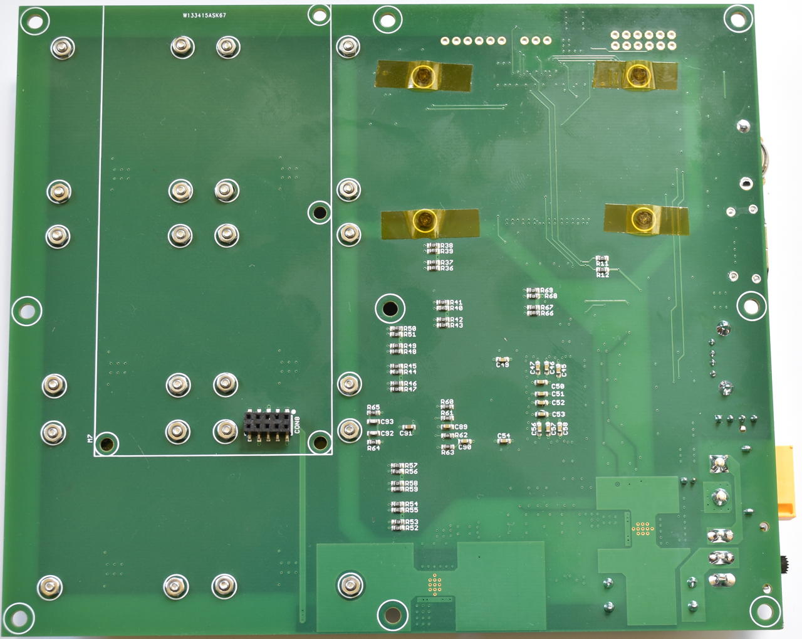

#### Sensor mounting
Sensors, such as tCam-Eth, must be mounted using a 2.5mm spacer.  An example 3D-printed spacer may be found in the tCam-Eth repository.  The sensor is secured to FireTIRS using a M2 screw, nut and washer.  In high-vibration environments it may be necessary to affix a piece of tape or glue to each nut on the bottom of FireTIRS.

#### Local Ethernet cable
FireTIRS may be connected to an existing 10/100 Mbps ethernet network using a custom cable assembly to adapt a RJ45 network connector to CON8 on the back of the board.  This connector carries two pairs of differential network signals from an isolation transformer and may connected directly to a network.

Easiest is to take a commonly available short network extension cable with a RJ45 jack on one end and a RJ45 plug on the other, cut the RJ45 plug off and wire the cable to a Molex 87758-1016 10-pin header as shown in the following table.  Use heat-shrink tubing to secure each solder connection and to secure the connector to the cable.

| CON8 Pin | Connection |
| --- | --- |
| 6 | RX- Solid Orange Wire - RJ45 pin 6 |
| 7 | RX+ Orange/White Wire - RJ45 pin 3 |
| 9 | TX- Solid Green Wire - RJ45 pin 2 |
| 10 | TX+ Green/White Wire - RJ45 pin 1 |

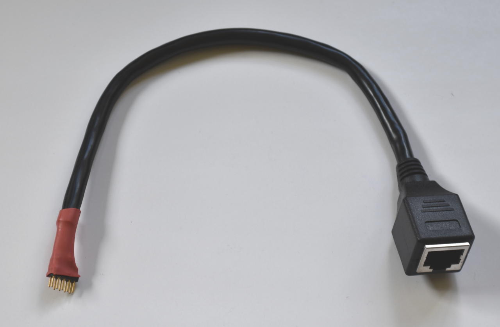